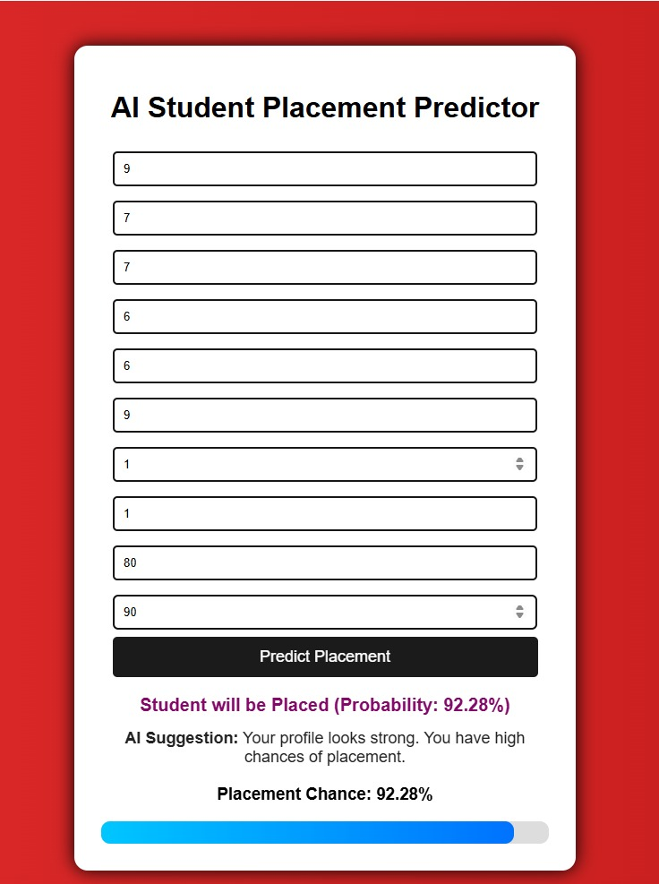
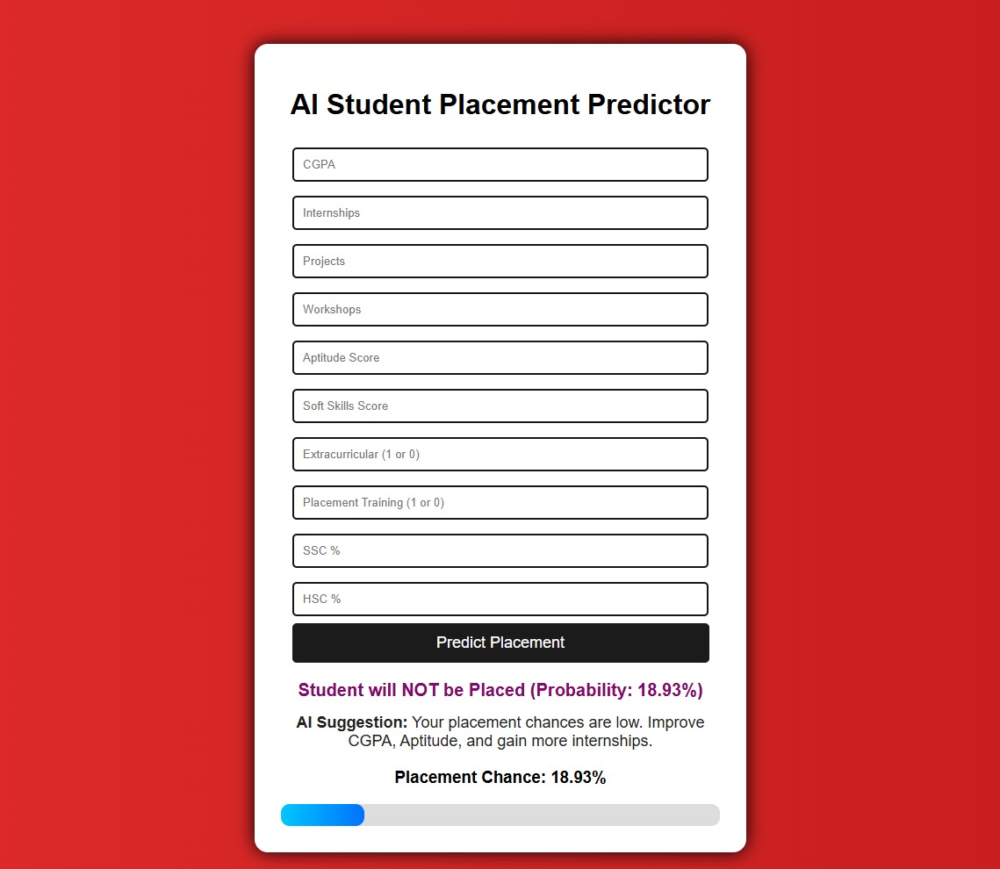

# AI-Based Student Placement Prediction System

## 📌 Problem Statement
Students often do not know their placement readiness. This project predicts whether a student will get placed based on academic and skill parameters.

## 💡 Solution
A Machine Learning model is trained to classify students as Placed or Not Placed. The system also provides probability percentage and improvement suggestions.

## 🛠 Technologies Used
- Python
- Flask
- Scikit-learn
- NumPy
- Pandas
- HTML & CSS

## 🤖 Algorithm Used
Logistic Regression (Binary Classification)

## 📊 Features
- Placement prediction
- Probability percentage output
- AI-based improvement suggestions
- Web interface using Flask

## 🚀 How to Run
1. Install requirements:
   pip install -r requirements.txt
2. Run the application:
   python app.py
3. Open browser:
   http://127.0.0.1:5000

## 🔮 Future Scope
- Deploy on cloud platform
- Add data visualization dashboard
- Integrate resume analysis
- Use larger real-world dataset# Student-Placement-Prediction
AI-based Student Placement Prediction System built using Machine Learning and Flask. The model predicts whether a student will get placed based on academic and skill parameters, provides placement probability percentage, and generates intelligent suggestions to improve placement chances.
## 📸 Application Preview

### Input Form

### Prediction Result

